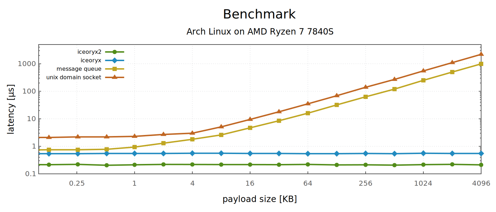
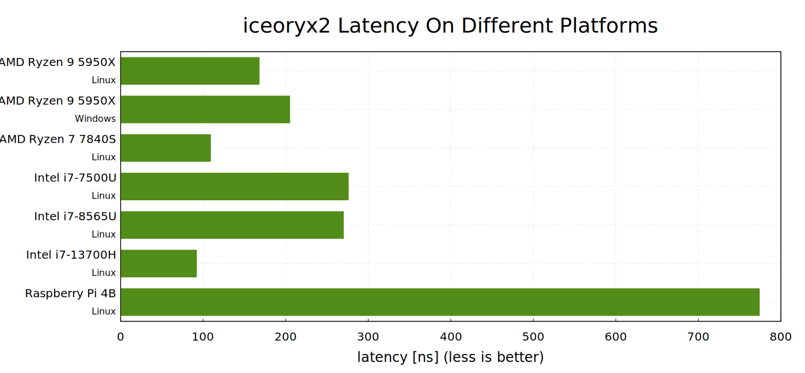

[](https://github.com/eclipse-iceoryx/iceoryx2/actions/workflows/build-test.yml?query=branch%3Amain++)
[](https://cirrus-ci.com/github/eclipse-iceoryx/iceoryx2/main)
[](https://codecov.io/gh/eclipse-iceoryx/iceoryx2?branch=main)
[](benchmarks/README.md)
[](CHANGELOG.md)
[](https://crates.io/crates/iceoryx2)
[](examples/)
[](FAQ.md)
[](https://gitter.im/eclipse/iceoryx)
[](https://opensource.org/licenses/Apache-2.0)
[](ROADMAP.md)

<p align="center">

</p>

# iceoryx2 - Zero-Copy Lock-Free IPC Purely Written In Rust

 1. [Introduction](#introduction)
 2. [Performance](#performance)
 3. [Getting Started](#getting-started)
    1. [Publish Subscribe](#publish-subscribe)
    2. [Events](#events)
    3. [Custom Configuration](#custom-configuration)
 4. [Supported Platforms](#supported-platforms)
 5. [Language Bindings](#language-bindings)
 6. [Commercial Support](#commercial-support)
 7. [Thanks To All Contributors](#thanks-to-all-contributors)

## Introduction

Welcome to iceoryx2, the efficient, and ultra-low latency inter-process communication
middleware. This library is designed to provide you with fast and reliable
zero-copy and lock-free inter-process communication mechanisms.

iceoryx2 is all about providing a seamless experience for inter-process
communication, featuring versatile messaging patterns. Whether you're diving
into publish-subscribe, events, or the promise of upcoming features like
request-response, pipelines, and blackboard, iceoryx2 has you covered.

One of the features of iceoryx2 is its consistently low transmission latency
regardless of payload size, ensuring a predictable and reliable
communication experience.

iceoryx2's origins can be traced back to
[iceoryx](https://github.com/eclipse-iceoryx/iceoryx). By overcoming past
technical debts and refining the architecture, iceoryx2 enables the modularity
we've always desired.

In the near future, iceoryx2 is poised to support at least the same feature set
and platforms as [iceoryx](https://github.com/eclipse-iceoryx/iceoryx),
ensuring a seamless transition and offering enhanced
capabilities for your inter-process communication needs. So, if you're looking
for lightning-fast, cross-platform communication that doesn't compromise on
performance or modularity, iceoryx2 is your answer.

## Performance

### Comparision Of Mechanisms



**Benchmark-System**

- **CPU:** AMD Ryzen 7 7840S with Radeon 780M Graphics
- **OS:** Linux 6.8.5-arch1-1 #1 SMP PREEMPT_DYNAMIC GNU/Linux
- **Compiler:**
  - rustc 1.77.1
  - gcc 13.2.1 20230801

### Comparision Of Architectures



## Getting Started

### Publish Subscribe

This minimal example showcases a publisher sending the number 1234 every second,
while a subscriber efficiently receives and prints the data.

**publisher.rs**

```rust
use core::time::Duration;
use iceoryx2::prelude::*;

const CYCLE_TIME: Duration = Duration::from_secs(1);

fn main() -> Result<(), Box<dyn std::error::Error>> {
    let node = NodeBuilder::new().create::<ipc::Service>()?;

    let service = node.service_builder(&"My/Funk/ServiceName".try_into()?)
        .publish_subscribe::<usize>()
        .open_or_create()?;

    let publisher = service.publisher_builder().create()?;

    while let NodeEvent::Tick = node.wait(CYCLE_TIME) {
        let sample = publisher.loan_uninit()?;
        let sample = sample.write_payload(1234);
        sample.send()?;
    }

    Ok(())
}
```

**subscriber.rs**

```rust
use core::time::Duration;
use iceoryx2::prelude::*;

const CYCLE_TIME: Duration = Duration::from_secs(1);

fn main() -> Result<(), Box<dyn std::error::Error>> {
    let node = NodeBuilder::new().create::<ipc::Service>()?;

    let service = node.service_builder(&"My/Funk/ServiceName".try_into()?)
        .publish_subscribe::<usize>()
        .open_or_create()?;

    let subscriber = service.subscriber_builder().create()?;

    while let NodeEvent::Tick = node.wait(CYCLE_TIME) {
        while let Some(sample) = subscriber.receive()? {
            println!("received: {:?}", *sample);
        }
    }

    Ok(())
}
```

This example is a simplified version of the
[publish-subscribe example](examples/rust/publish_subscribe/). You can
execute it by opening two terminals and calling:

**Terminal 1:**

```sh
cargo run --example publish_subscribe_publisher
```

**Terminal 2:**

```sh
cargo run --example publish_subscribe_subscriber
```

### Events

This minimal example showcases how push-notifications can be realized by using services
with event messaging pattern between two processes. The `listener.rs` hereby waits for a notification from the `notifier.rs`.

**notifier.rs**

```rust
use core::time::Duration;
use iceoryx2::prelude::*;

const CYCLE_TIME: Duration = Duration::from_secs(1);

fn main() -> Result<(), Box<dyn std::error::Error>> {
    let node = NodeBuilder::new().create::<ipc::Service>()?;

    let event = node.service_builder(&"MyEventName".try_into()?)
        .event()
        .open_or_create()?;

    let notifier = event.notifier_builder().create()?;

    let id = EventId::new(12);
    while let NodeEvent::Tick = node.wait(CYCLE_TIME) {
        notifier.notify_with_custom_event_id(id)?;

        println!("Trigger event with id {:?} ...", id);
    }

    Ok(())
}
```

**listener.rs**

```rust
use core::time::Duration;
use iceoryx2::prelude::*;

const CYCLE_TIME: Duration = Duration::from_secs(1);

fn main() -> Result<(), Box<dyn std::error::Error>> {
    let node = NodeBuilder::new().create::<ipc::Service>()?;

    let event = node.service_builder(&"MyEventName".try_into()?)
        .event()
        .open_or_create()?;

    let listener = event.listener_builder().create()?;

    while let NodeEvent::Tick = node.wait(Duration::ZERO) {
        if let Ok(Some(event_id)) = listener.timed_wait_one(CYCLE_TIME) {
            println!("event was triggered with id: {:?}", event_id);
        }
    }

    Ok(())
}
```

**listener.rs** grabbing all events at once

```rust
use core::time::Duration;
use iceoryx2::prelude::*;

const CYCLE_TIME: Duration = Duration::from_secs(1);

fn main() -> Result<(), Box<dyn std::error::Error>> {
    let node = NodeBuilder::new().create::<ipc::Service>()?;

    let event = node.service_builder(&"MyEventName".try_into()?)
        .event()
        .open_or_create()?;

    let listener = event.listener_builder().create()?;

    while let NodeEvent::Tick = node.wait(Duration::ZERO) {
        listener.timed_wait_all(
            |event_id| {
                println!("event was triggered with id: {:?}", event_id);
            },
            CYCLE_TIME,
        )?;
    }

    Ok(())
}
```

This example is a simplified version of the
[event example](examples/rust/event/). You can
execute it by opening two terminals and calling:

**Terminal 1:**

```sh
cargo run --example event_notifier
```

**Terminal 2:**

```sh
cargo run --example event_listener
```

### Custom Configuration

It is possible to configure default quality of service settings, paths and file suffixes in a
custom configuration file. For more details visit the [configuration directory](config/).

## Supported Platforms

The support levels can be adjusted when required.

| Operating System | State        | Current Support Level | Target Support Level |
|------------------|:-------------|:---------------------:|---------------------:|
| Android          | planned      | -                     | tier 1               |
| FreeBSD          | done         | tier 2                | tier 1               |
| FreeRTOS         | planned      | -                     | tier 2               |
| iOS              | planned      | -                     | tier 2               |
| Linux (x86_64)   | done         | tier 2                | tier 1               |
| Linux (aarch64)  | done         | tier 2                | tier 1               |
| Linux (32-bit)   | done         | tier 2                | tier 1               |
| Mac OS           | done         | tier 2                | tier 2               |
| QNX              | planned      | -                     | tier 1               |
| WatchOS          | planned      | -                     | tier 2               |
| Windows          | done         | tier 2                | tier 2               |

- **tier 1** - All safety and security features are working.
- **tier 2** - Works with a restricted security and safety feature set.
- **tier 3** - Work in progress. Might compile and run or not.

## Language Bindings

| Language | State    |
|----------|---------:|
| C / C++  | planned  |
| Lua      | planned  |
| Python   | planned  |
| Zig      | planned  |

## Commercial Support

<!-- prettier-ignore-start -->
<!-- markdownlint-disable -->

<table width="100%">
  <tbody>
    <tr>
      <td align="center" valign="top" width="33%">
        <a href="https://ekxide.io">
        <br />
        </a>
        <a href="mailto:info@ekxide.io">info@ekxide.io</a>
      </td>
      <td>
        <ul>
          <li>commercial extensions and tooling</li>
          <li>custom feature development</li>
          <li>training and consulting</li>
          <li>integration support</li>
          <li>engineering services around the iceoryx ecosystem</li>
        </ul>
      </td>
    </tr>
  </tbody>
</table>

<!-- markdownlint-restore -->
<!-- prettier-ignore-end -->

## Thanks To All Contributors

<!-- prettier-ignore-start -->
<!-- markdownlint-disable -->

<table>
  <tbody>
    <tr>
      <td align="center" valign="top" width="14.28%">
          <a href="https://github.com/elfenpiff">
          <br />
          <sub><b>Christian »elfenpiff« Eltzschig</b></sub></a></td>
      <td align="center" valign="top" width="14.28%">
          <a href="https://github.com/elboberido">
          <br />
          <sub><b>Mathias »elBoberido« Kraus</b></sub></a></td>
    </tr>
  </tbody>
</table>

<!-- markdownlint-restore -->
<!-- prettier-ignore-end -->
