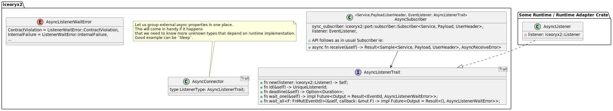
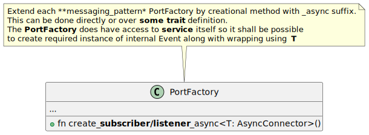

# Async API Design Document

## Remarks

For this document currently we describe `Events` and `PubSub` however this
analogy shall continue for other messaging patterns later on.

## Terminology

## Overview

A high-level pitch of the feature:

* The new `async` API will provide non_blocking, but still linear, behavior in
  the code thanks to `async/await`
* The new `async` API will solve a usage of `iceoryx2` API in `async` code which
  currently need to be handmade manually either via:
    * polling and repetition logic within functions, causing additional not needed
    code on user side
    * custom WaitSet usage in separate thread and a bridge to `async` world.
    * or some other custom work
* The `async` usage in Rust is already well established technique that is
  adopted by many crates, including those with highest usage

## Requirements

* **R1: Async API look and feel** \* The new `async` API shall provide the same
  look and feel as standard one

## Use Cases

### Use-Case 1: Waiting for an event

* **As a** developer
* **I want** to wait on `event` API
* **So that** it does not block current thread and continues only once event is
  delivered

### Use-Case 2: Waiting for a new sample

* **As a** developer
* **I want** to wait on `new sample` in pub-sub
* **So that** it does not block current thread and continues only once sample is
  delivered

## Usage

### Example: Await on events

```rust
let node = NodeBuilder::new().create::<ipc_threadsafe::Service>().unwrap();

let event = node
    .service_builder(&"MyEventName".try_into().unwrap())
    .event()
    .open_or_create()
    .unwrap();

let listener = event.listener_builder().create_async().unwrap();

println!("Awaiting for Iceoryx event in batches while doing something else ...");

listener
    .wait_all(&mut |event_id| {
        print!("Received Iceoryx event: {:?}\n", event_id);
    })
    .await
    .unwrap();
```

## Implementation

### Achieving async API

Since all iceoryx2 messaging patterns (except `Event`) are poll based, we need
to pair them them with the `Event` to achieve possibility to react in `async`
API only on change of data. This means:

* `PubSub` should be paired with `Event`
* `RequestResponse` should be paired with `Event`
* and so on

Due to this, further document assumes direct usage of high level `Event`
messaging pattern to facilitate the feature.

> DISCLAIMER: IT may be that iceoryx2 authors will have better idea than that.
> The only issue I do see now is probably impact on zero-trust deployment during
> configuration where ie. async PubSub Producer shall also have rights to be
> Event Notifier on some connected topic.

### Split of code

The main idea is to split source code into two parts:

1. The Event implementation that is both `OS` dependent and `runtime` dependent
    since it incurs some IO call
2. All the other API that do need `Event` implementation, but the rest is
    purely `runtime` independent and can be pure `async`

To facilitate above, below class diagram is showing one of solution



### Building objects

The next step is to provide a way to build objects that provide `async` API.

There are two approaches that can be chosen for implementation:

#### 1. Use custom event for each pair (messaging patern, data type) based on `ServiceName`

##### Pros

* all messaging pattern in service will work as usual
* no limitations

##### Cons

* dynamic Service creation to obtain event for each messaging pattern, like for
  `ServiceNameABC` (PubSub, int) we need to create also internally service
  `ServiceNameABC/__internal_pubsub_event` to obtain event for notifications

#### 2. Use event from the service `ServiceName`

##### Pros

* no need to create dynamic event name

##### Cons

* limit a service to only single messaging pattern as using event will cause no
  way to use it again

Considering above, continuation is done based on option 1. Below shows only
small snippet where extension for creating object can be placed.



### Implementation

#### AsyncListener - `messaging-patter == event`

This is purely `runtime` specific implementation but is currently doable with
`non-blocking` api of `Listener`. Working example:
[Code sample](assets/event_example.rs) During implementation it may come
beneficial to either expose some properties (of current listener) or `add` new
sync api with different signature.

#### AsyncSubscriber - `messaging-patter == pubsub`

Pure `async` implementation not using any specifics of `runtime` shall be
doable. In case some unexpected dependency will be needed it has to be exposed
over defined abstraction same as `AsyncListenerTrait`

#### Builder

Implement the `Builders` extensions to they can provide `async` versions of objects

## Certification & Safety-Critical Usage

Answer:

* Applicable standards (e.g., ASIL-D, ISO 26262)
* Support for **zero-trust deployments**: can rogue processes break it?
* Evidence for claims (e.g., subscribers cannot corrupt publisher-owned
  read-only memory)
* Real-time suitability: any blocking calls, background threads, or
  indeterminism?
* If unsuitable for zero-trust or real-time use, how do we prevent accidental
  misuse?

PR: To me idea, we will build async API on top of existing non-blocking, non
async implementation and the API will be just a thin wrapper. The connection to
specific `runtime` is outside of project and in gesture of specific `runtime` to
guarantee any of above.

## Milestones

### Milestone 1 – Provide Traits and object skeletons

* TBD later

**Results:**

* User will see that there is ongoing work on `async` API

### Milestone 2 – Implement Event in Async Runtime

* TBD later

**Results:**

* User will get first support for async API for specific runtime. This will also
  open a way for other to implement a bridge to other runtime like `tokio` as
  basic idea will be shown

### Milestone 2 – Implement PubSub

* TBD later

**Results:**

* PubSub API will have `async` API available
