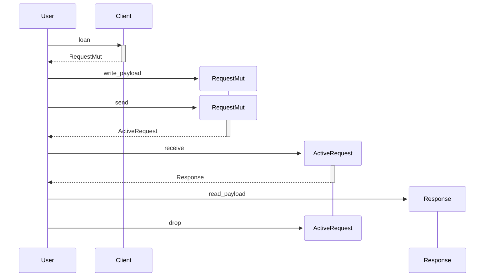

# Request-Response

## Sending Request: Client View

```mermaid
sequenceDiagram
    User->>+Client: loan
    Client-->>-User: RequestMut
    create participant RequestMut
    User->>RequestMut: write_payload
    destroy RequestMut
    User->>+RequestMut: send
    RequestMut-->>-User: ActiveRequest
    create participant ActiveRequest
    User->>+ActiveRequest: receive
    ActiveRequest-->>-User: Response
    create participant Response
    User->>Response: read_payload
    destroy ActiveRequest
    User->>ActiveRequest: drop
```

## Responding: Server View

```mermaid
sequenceDiagram
    User->>+Server: receive
    Server-->>-User: ActiveResponse
    create participant ActiveResponse
    User->ActiveResponse: read_payload
    User->>+ActiveResponse: loan
    ActiveResponse-->>-User: ResponseMut
    create participant ResponseMut
    User->>ResponseMut: write_payload
    destroy ResponseMut
    User->>ResponseMut: send
    destroy ActiveResponse
    User->>ActiveResponse: drop
```
