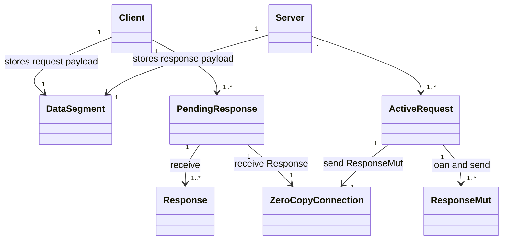
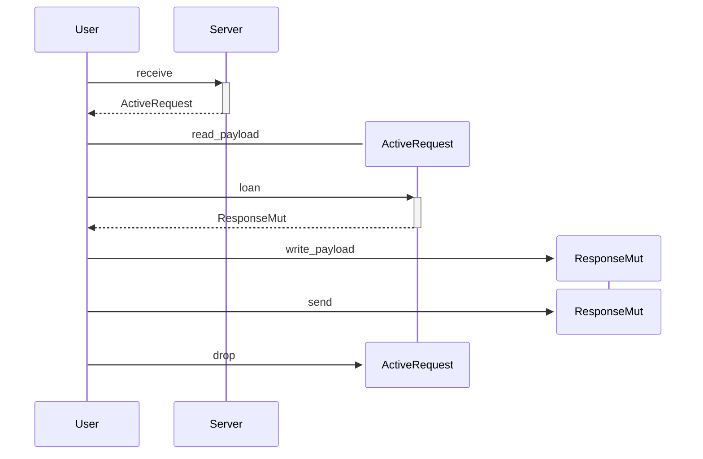

# Request-Response

## Classes Involved In PendingResponse to ActiveRequest Stream Communication

User has send request to the server and receives a stream of responses.

## Sending Request: Client View

## Responding: Server View

